# Valorant Companion

Application mobile **Flutter** dédiée à Valorant : des lineups posés sur le plan tactique, une encyclopédie complète du jeu
(agents, armes, cartes, rangs) doublée d'une page profil qui affiche vos statistiques
de joueur à partir de votre Riot ID.

Toutes les données de jeu (visuels, statistiques, traductions françaises) viennent de
[valorant-api.com](https://valorant-api.com) ; les données de compte viennent de
[api.henrikdev.xyz](https://docs.henrikdev.xyz).

> Le dossier du projet s'appelle encore `mybmw` (nom du template de départ), mais
> l'application elle-même s'appelle *Valorant Companion*.

---

## Aperçu

<table>
  <tr>
    <td align="center">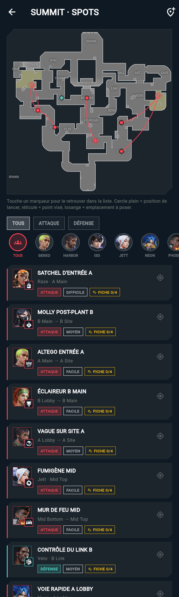<br><sub><b>Lineups</b> — les spots sur le plan</sub></td>
    <td align="center">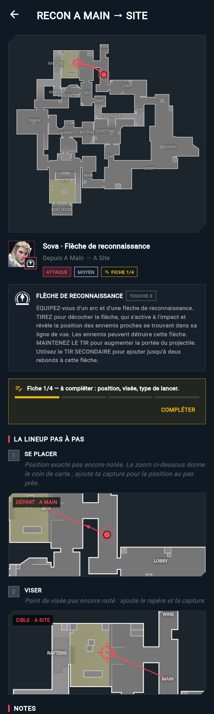<br><sub><b>Fiche d'un spot</b> — zooms du plan, compétence, étapes</sub></td>
    <td align="center">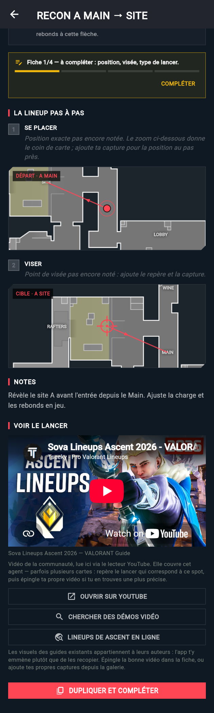<br><sub><b>Démo vidéo</b> — lue dans la fiche</sub></td>
    <td align="center">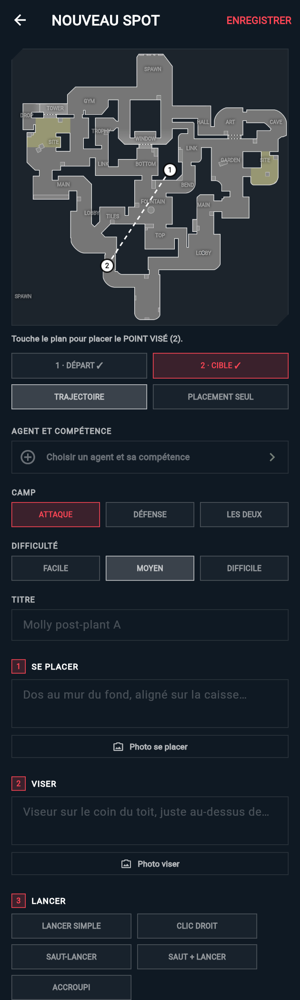<br><sub><b>Éditeur</b> — points, étapes, photos</sub></td>
  </tr>
  <tr>
    <td align="center">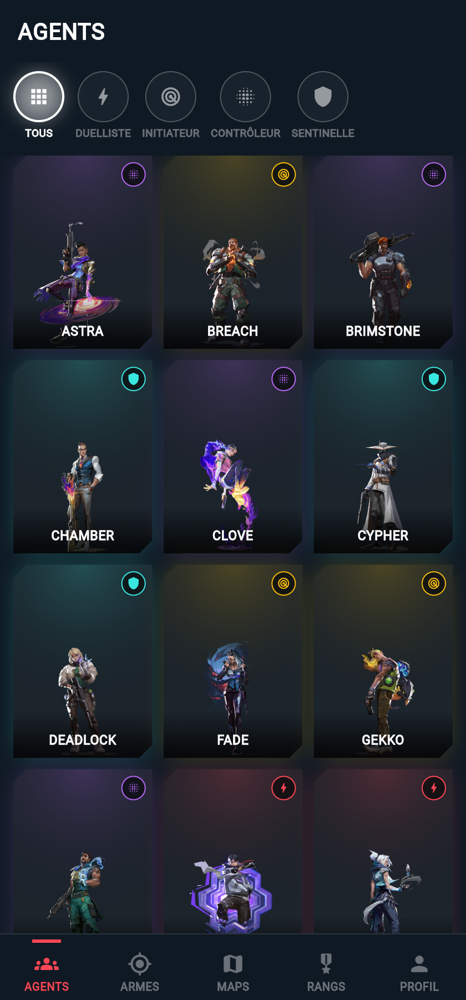<br><sub><b>Agents</b> — filtre par rôle</sub></td>
    <td align="center">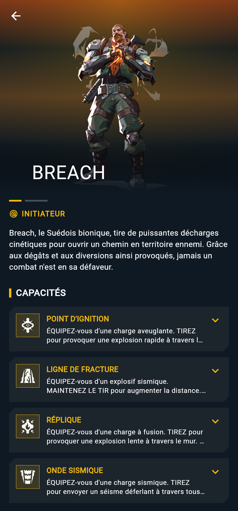<br><sub><b>Fiche agent</b> — compétences</sub></td>
    <td align="center">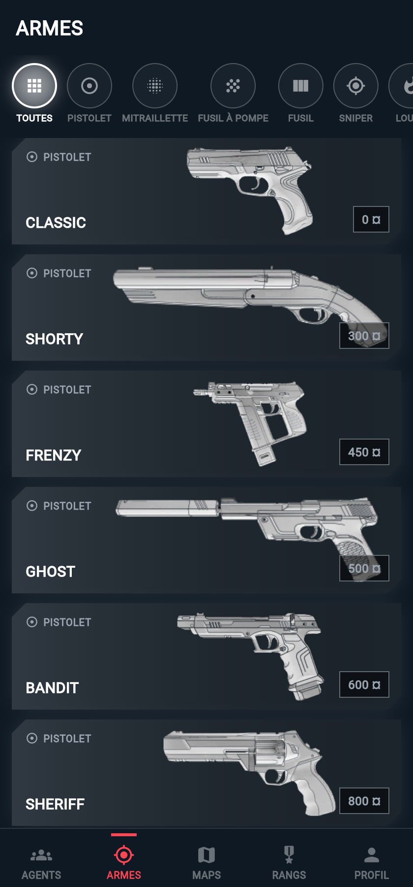<br><sub><b>Armes</b> — par catégorie</sub></td>
    <td align="center">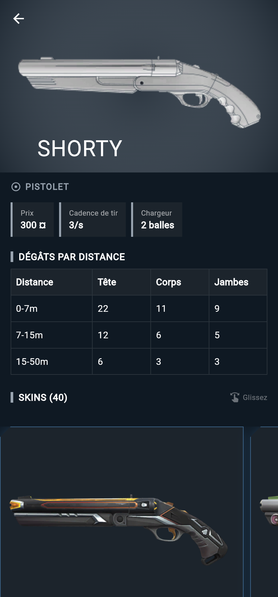<br><sub><b>Fiche arme</b> — dégâts & skins</sub></td>
  </tr>
  <tr>
    <td align="center">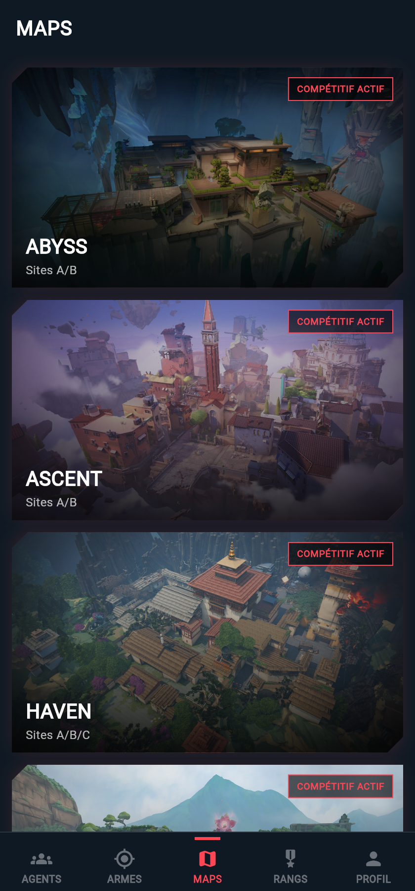<br><sub><b>Cartes</b> — pool compétitif</sub></td>
    <td align="center">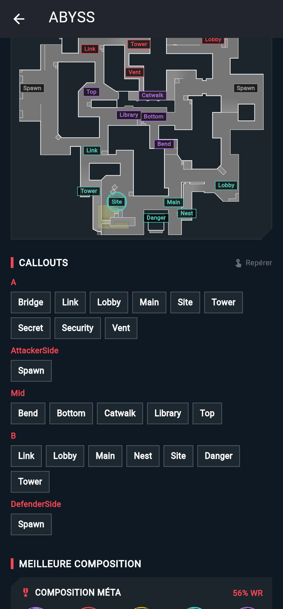<br><sub><b>Minimap tactique</b> — callouts</sub></td>
    <td align="center">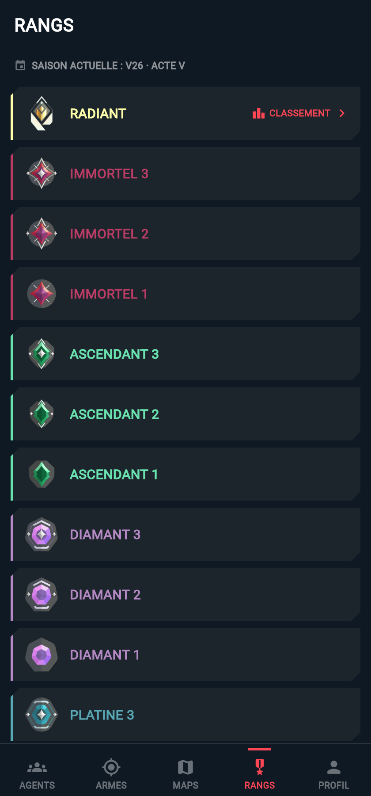<br><sub><b>Rangs</b> — saison en cours</sub></td>
    <td align="center">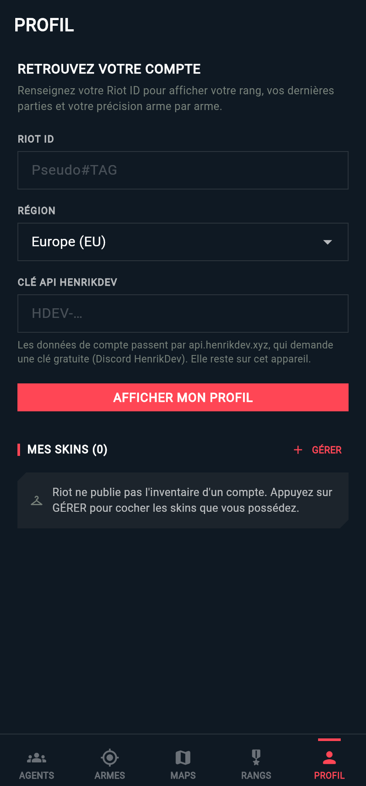<br><sub><b>Profil</b> — connexion Riot ID</sub></td>
  </tr>
  <tr>
    <td align="center">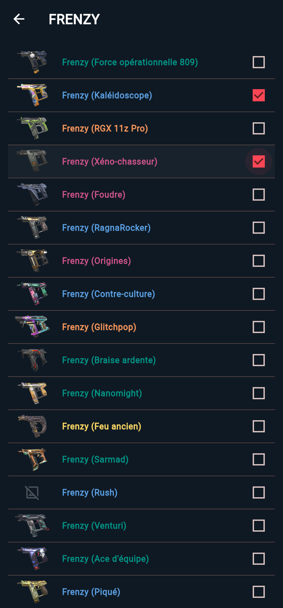<br><sub><b>Collection</b> — cocher ses skins</sub></td>
    <td align="center">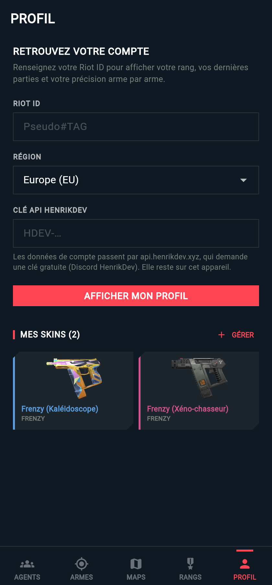<br><sub><b>Mes skins</b> — par rareté</sub></td>
    <td align="center">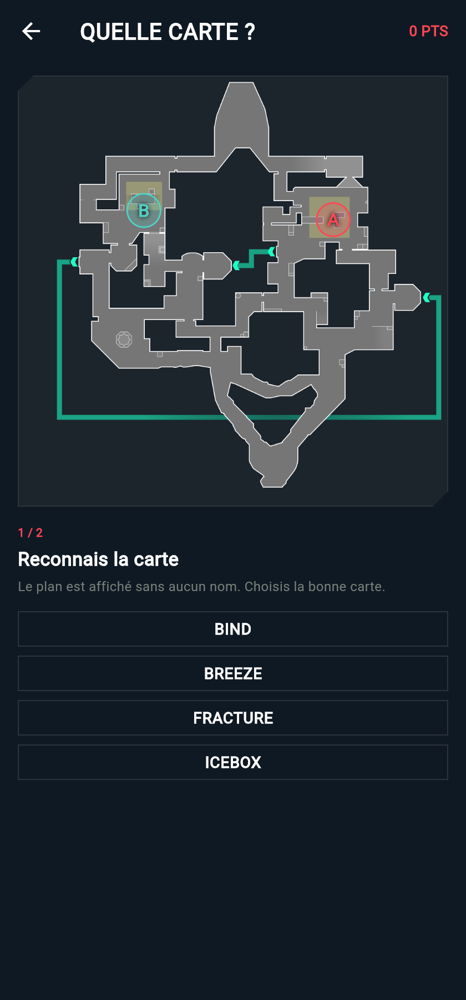<br><sub><b>Entraînement cartes</b> — quelle carte ?</sub></td>
    <td align="center">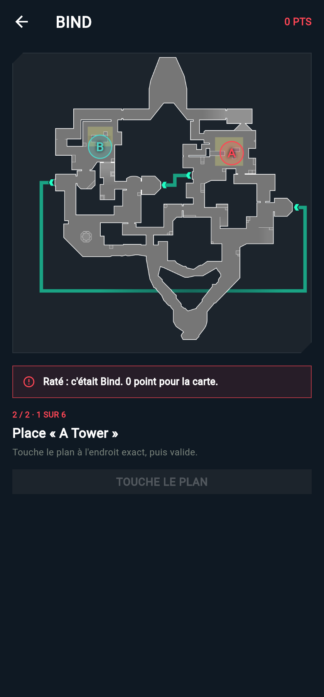<br><sub><b>Entraînement cartes</b> — placer les callouts</sub></td>
  </tr>
  <tr>
    <td align="center">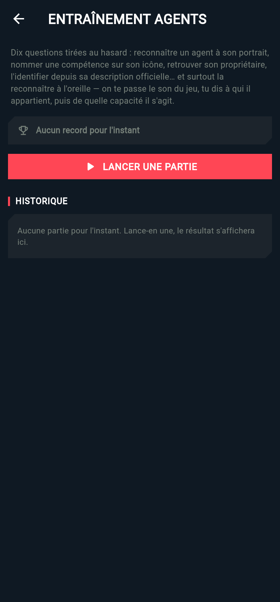<br><sub><b>Entraînement agents</b> — dix questions tirées au hasard</sub></td>
    <td align="center">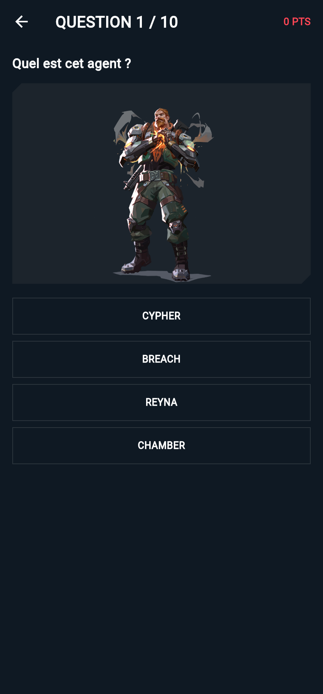<br><sub><b>Entraînement agents</b> — portrait, icône, description…</sub></td>
    <td align="center">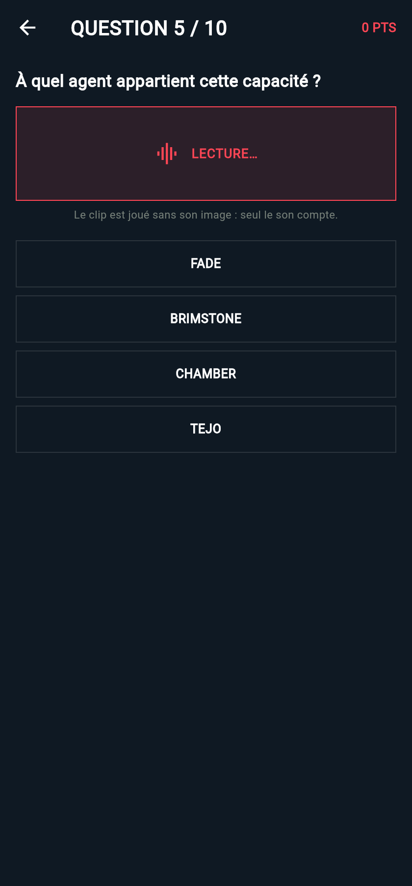<br><sub><b>Manche sonore</b> — à qui est cette capacité ?</sub></td>
    <td align="center">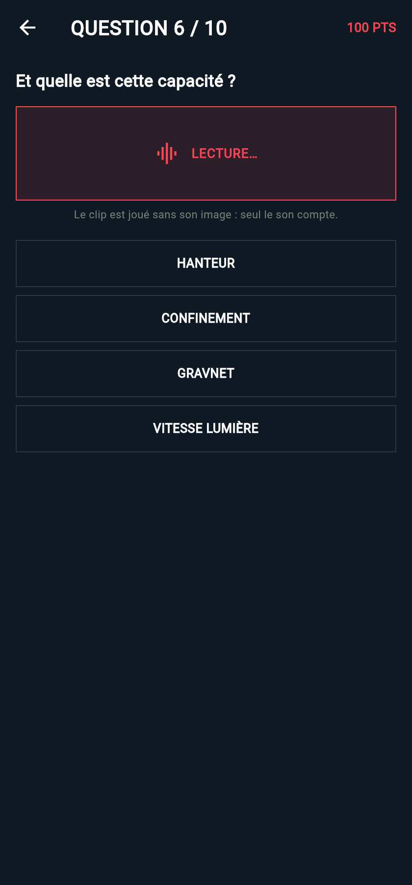<br><sub><b>Manche sonore</b> — et sur le même son, laquelle ?</sub></td>
  </tr>
</table>

---

## Fonctionnalités

L'app est organisée en 6 onglets.

### 🎯 Lineups
Le cœur de l'app : les spots d'utilitaire posés directement sur le plan tactique, là où les
autres outils restent sur navigateur.

- Un plan par carte avec **tous les spots dessinés** : arc de lancer entre la position et le
  point visé, losange pour un emplacement à poser, couleur selon le camp (attaque / défense).
  Les spots partageant les mêmes repères se déploient en éventail pour rester lisibles.
- Filtres par agent et par camp, et sélection croisée : on touche un marqueur, la fiche
  correspondante se met en avant dans la liste.
- **Un zoom du plan sur chaque point** : la fiche affiche un gros plan de la minimap Riot
  centré sur la position de lancer et un autre sur le point visé, avec leur marqueur, **les
  callouts voisins** et la flèche de trajectoire qui sort du cadre — on sait quel coin de
  pièce on regarde, au lieu d'un point perdu sur la carte entière.
- **Ce que fait la compétence**, repris mot pour mot du catalogue officiel (icône, touche et
  description FR), pour lire un spot d'un agent qu'on ne joue jamais.
- **Une fiche en 4 étapes**, parce qu'un trait sur un plan ne suffit pas à rejouer un lancer :
  **1. Se placer** (où poser ses pieds) · **2. Viser** (ce que le viseur doit toucher) ·
  **3. Lancer** (simple, clic droit, saut-lancer, saut + lancer, accroupi) · **4. Résultat**.
  Chaque étape accepte sa photo, et le résultat accepte une vidéo. **Une étape sans rien à
  montrer n'est pas affichée** : elle apparaît dans la ligne de progression, qui nomme ce
  qui manque (« Fiche 1/4 — à compléter : position, visée, type de lancer »). La liste des
  spots reprend le même compteur.
- **Une vidéo de démo sur chaque spot** : le lecteur YouTube est intégré à la fiche, donc la
  démo se regarde sans quitter le spot (le créateur garde ses vues et son attribution). Les
  **97 spots arrivent avec une vidéo de la communauté épinglée** et son titre affiché : 20
  sont propres au couple agent + carte, les autres sont le guide « toutes cartes » de
  l'agent. Deux boutons complètent : une recherche vidéo ciblée sur le trajet exact, et les
  lineups de la carte sur un site communautaire. Tu peux remplacer n'importe quelle vidéo
  épinglée par la tienne.
- **Éditeur intégré** : on place les deux points au doigt sur le plan, on choisit l'agent et
  la compétence (les 29 agents du catalogue, avec leurs icônes), le camp, la difficulté, les
  quatre étapes et les médias. Tout est enregistré sur l'appareil.
- **97 spots livrés avec l'app**, couvrant les 29 agents sur les 13 cartes. Ils servent de
  point de départ : voir les limites plus bas.

### 🧑‍🚀 Agents
- Liste complète des agents jouables, filtrable par rôle (duelliste, initiateur, contrôleur, sentinelle).
- **Entraînement agents** — dix questions tirées au hasard, mêlant cinq types :
  reconnaître un agent à son **portrait**, nommer une compétence sur son **icône**, retrouver
  **à qui** elle appartient, l'identifier depuis sa **description officielle**, et la
  reconnaître **à l'oreille**.
- **La manche sonore va par deux** : le clip officiel est joué *sans son image*, seul le son
  compte. On te demande d'abord **à quel agent** appartient la capacité, puis, sur le même
  extrait, **quelle capacité** c'est — la première correction se garde donc bien de la nommer.
  Environ la moitié des clips de Riot sont muets : `scripts/scan_ability_sounds.dart` les
  écoute tous et ne retient dans `assets/data/ability_sounds.json` que ceux qui ont vraiment
  une piste audio (52 clips, 14 agents), pour qu'une question ne tombe jamais sur du silence.
- Quatre propositions par question, correction immédiate qui nomme l'agent et la compétence,
  1000 points en jeu, record et historique conservés sur l'appareil.
- Fiche détaillée : portrait, description, dégradé de couleurs officiel, et les 4 compétences dépliables.
- Aperçu vidéo de chaque compétence (clips officiels de playvalorant.com, pré-collectés dans
  `assets/data/ability_videos.json` via `scripts/scrape_ability_videos.ps1`).

### 🔫 Armes
- Catalogue trié par prix, filtrable par catégorie.
- Fiche arme : prix, cadence de tir, chargeur, et **tableau des dégâts tête / corps / jambes par distance**.
- Carrousel des skins de l'arme, colorés selon leur rareté (Select → Ultra), avec les vidéos d'animation.

### 🗺️ Cartes
- Toutes les cartes classées, avec un badge « compétitif actif » sur celles du pool en cours.
- **Minimap tactique** générée à partir des coordonnées Riot : sites A/B/C et callouts positionnés sur le plan.
- Liste des callouts regroupés par zone + composition méta conseillée avec son win rate
  (données communautaires maintenues à la main dans `map_meta_data.dart`, à rafraîchir selon la meta).
- **Entraînement callouts** — un mini-jeu, en tête de l'onglet, avec deux formules :
  - **Partie complète (700 pts)** : la carte est **tirée au sort**, tu dois la reconnaître
    parmi quatre, puis placer six callouts.
  - **Entraînement ciblé (600 pts)** : tu choisis la carte, la manche « devine la carte »
    saute — elle n'aurait plus de sens — et on passe directement aux callouts.

  Les six callouts sont **retirés au hasard à chaque partie** et répartis entre les sites,
  donc deux parties sur la même carte ne se ressemblent pas. Seules les lettres **A / B / C**
  restent affichées sur le plan pour s'orienter ; tout le reste est masqué. Le score suit la
  précision — parfait sous 4 % de la carte d'écart, dégressif ensuite, nul au-delà de 22 % —
  et la bonne position apparaît après chaque réponse, reliée à ton doigt. Record par carte
  **et par formule**, plus un **historique des 25 dernières parties**, gardés sur l'appareil.

### 🏅 Rangs
- Tous les paliers du plus haut au plus bas, aux couleurs officielles, avec l'épisode / acte en cours.

### 👤 Profil
Saisissez votre Riot ID (`Pseudo#TAG`) et votre région pour afficher :
- **Rang compétitif** : palier, RR avec barre de progression, dernier gain/perte de points, elo, pic de carrière.
- **Historique** : les 10 dernières parties (agent, carte, mode, score en rounds, K/D/A, % de têtes, victoire/défaite).
- **Précision arme par arme** : répartition tête / corps / jambes, globale puis pour chaque arme.
- **Mes skins** : votre collection, cochée depuis le catalogue et conservée sur l'appareil.

Le Riot ID, la région et la clé API sont mémorisés localement — un tirer-pour-rafraîchir met tout à jour.

---

## Démarrage

Prérequis : [Flutter](https://docs.flutter.dev/get-started/install) sur le canal stable (Dart 3.13 ou plus).

```bash
flutter pub get
```

```bash
flutter run
```

L'encyclopédie fonctionne immédiatement, sans aucune clé : valorant-api.com est une API
publique et sans authentification.

### Clé API pour la page Profil

Les statistiques de joueur passent par l'API communautaire **HenrikDev**, qui demande une
clé gratuite (à demander sur leur [Discord](https://docs.henrikdev.xyz)). Deux façons de la fournir :

1. **Dans l'app** : onglet PROFIL → champ « Clé API HenrikDev ». Elle est stockée sur
   l'appareil (`shared_preferences`) et n'est jamais envoyée ailleurs qu'à HenrikDev.
2. **À la compilation**, pour ne pas la ressaisir :

```bash
flutter run --dart-define=HENRIK_API_KEY=HDEV-xxxxxxxx
```

---

## Architecture

Le projet suit un découpage par fonctionnalité, chacune en trois couches
(`domain` → modèles, `data` → accès réseau/stockage, `presentation` → écrans),
reliées par des providers [Riverpod](https://riverpod.dev).

```text
lib/
├─ app.dart                     # MaterialApp + thème
├─ core/
│  ├─ network/                  # clients HTTP : valorant-api.com et HenrikDev
│  ├─ theme/                    # palette et thème Valorant
│  └─ widgets/                  # briques réutilisables (coins coupés, images, nav…)
└─ features/
   ├─ encyclopedia/             # agents, armes, cartes, rangs
   │  ├─ domain/ data/ presentation/ providers/
   ├─ lineups/                  # spots sur le plan tactique + éditeur
   │  ├─ domain/ data/ presentation/ providers/
   ├─ training/                 # mini-jeux : callouts sur le plan, quiz agents
   │  ├─ domain/ data/ presentation/ providers/
   └─ profile/                  # Riot ID, rang, historique, précision, skins
      ├─ domain/ data/ presentation/ providers/
```

Quelques principes suivis dans le code :

- Chaque source de données passe par un **repository** abstrait, ce qui rend les écrans
  testables et interchangeables (`EncyclopediaRepository`, `PlayerRepository`).
- Le parsing réseau est **défensif** : l'API HenrikDev a changé de noms de champs entre v2
  et v4, chaque lecture accepte les deux écritures.
- Chaque section de la page profil gère ses propres états chargement / erreur / vide :
  une requête qui échoue n'efface pas le reste de la page.
- Les spots sont ancrés soit sur des **coordonnées exactes** (celles posées dans l'éditeur),
  soit sur un **callout** résolu au chargement via la transformation monde → minimap de Riot.
  Un spot qui pointerait vers un callout absent de la carte est masqué plutôt que dessiné
  au mauvais endroit.

### Qualité

```bash
flutter analyze
```

```bash
flutter test
```

Les spots livrés se vérifient en plus contre les données vivantes de Riot (carte, agent,
slot de compétence, callouts) :

```bash
dart run scripts/validate_lineups.dart
```

La liste des extraits sonores se reconstruit quand Riot publie de nouveaux clips : le script
les télécharge tous et ne garde que ceux qui portent réellement une piste audio.

```bash
dart run scripts/scan_ability_sounds.dart
```

---

## Limites connues

- **Les 97 spots livrés sont des squelettes, pas des lineups vérifiées.** Ils disent quel
  agent, quelle compétence, depuis quelle zone vers quelle zone — leur position vient du
  callout Riot (« A Main », « Mid Market »…), pas d'un relevé en jeu. Ils s'affichent donc
  avec un « Fiche 1/4 » (la vidéo épinglée) : ni position exacte, ni point de visée, ni type
  de lancer.
  Le geste prévu est de les dupliquer, de déplacer les deux points au doigt, de remplir les
  quatre étapes et d'ajouter ses propres captures, puis de cocher « testé en jeu ».
  Un script de validation vérifie que chaque spot pointe vers un agent, une compétence et un
  callout qui existent réellement côté Riot.
- **Aucune photo ni vidéo de jeu n'est copiée dans l'app.** Les captures des guides existants
  appartiennent à leurs auteurs. L'app fait donc trois choses à la place : elle génère le
  **zoom du plan** sur chaque point (image Riot, pas celle d'un tiers), elle **lit les vidéos
  de la communauté via le lecteur YouTube officiel** (vues et attribution préservées), et
  elle range **tes** captures (galerie du téléphone) dans la bonne étape. Les vidéos
  épinglées couvrent l'agent, parfois sur plusieurs cartes : à toi de repérer le lancer qui
  correspond au spot. Leur titre est affiché sous le lecteur pour qu'il n'y ait pas de doute.
- **Les skins possédés ne sont pas récupérables automatiquement.** Riot n'expose aucune API
  publique d'inventaire ; y accéder demanderait de se connecter avec les identifiants Riot,
  ce que l'app ne fait pas. La collection est donc cochée à la main, puis conservée localement.
- **La précision par arme est une reconstruction.** Riot ne publie pas de statistique par arme :
  elle est recalculée round par round (arme tenue × impacts placés) sur les parties chargées.
  Les chiffres sont donc très proches de la réalité, sans en être la copie exacte.
- **Les aperçus vidéo ne marchent pas sur Windows ni Linux** : `video_player` n'y a pas
  d'implémentation. Les clips de compétences et de skins affichent alors un message explicite
  au lieu d'un cadre vide — teste sur Android, iOS, macOS ou le web.
- La page profil couvre les comptes **PC** ; la console utilise une autre plateforme côté API.
- Le classement Radiant (onglet Rangs) est encore un écran d'attente — il pourra utiliser
  l'endpoint leaderboard de HenrikDev maintenant qu'une clé est gérée par l'app.
- La composition méta par carte est saisie à la main et vieillit avec les patchs.

---

## Crédits

- [valorant-api.com](https://valorant-api.com) — données et visuels du jeu.
- [HenrikDev API](https://docs.henrikdev.xyz) — données de compte, rang et historique.
- Clips de compétences : pages officielles des agents sur playvalorant.com.

Projet personnel non affilié à Riot Games. Valorant et tous les éléments associés sont des
marques ou marques déposées de Riot Games, Inc.
